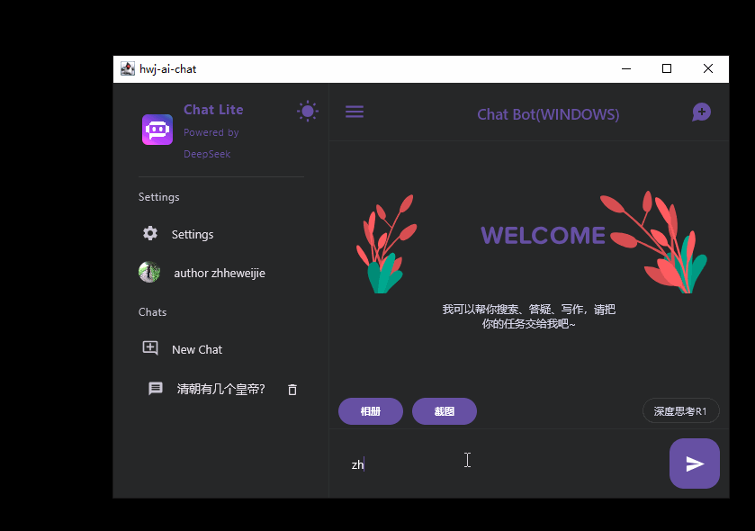
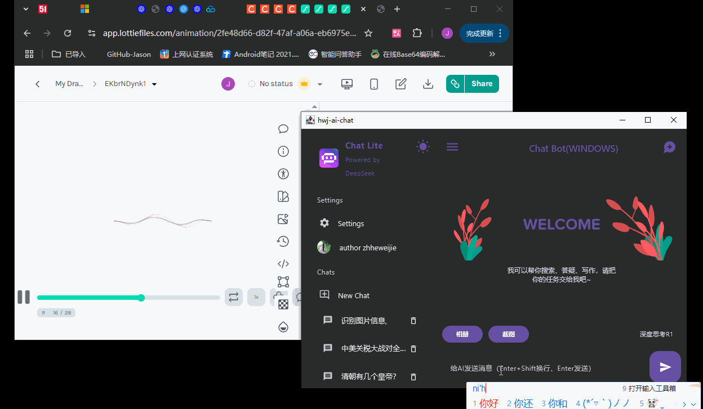
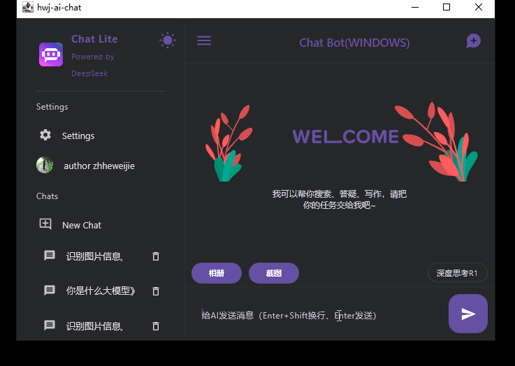
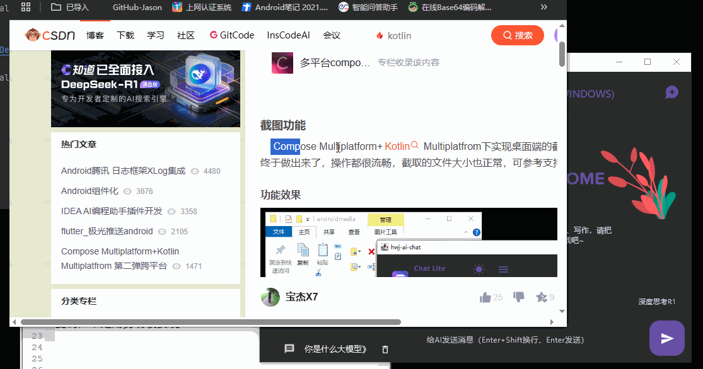
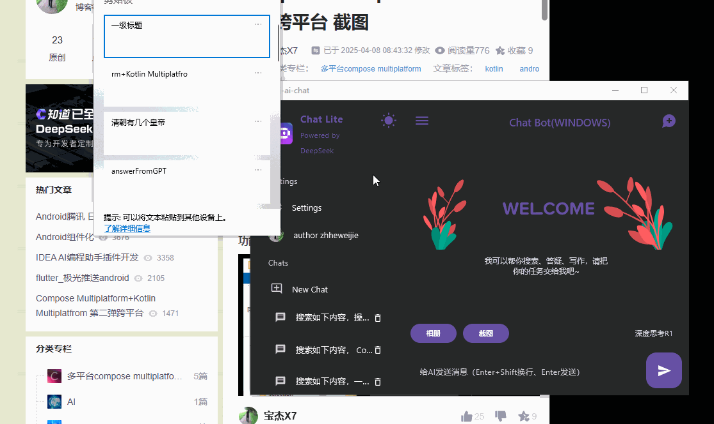

# testai1

#### Introduction

Compose Multiplatform + Kotlin Multiplatform.
A chat-prompt based app for Android, iOS, Desktop, Linux.

[English Version](./README.zh-CN.md)
#### Introduction

Using **Compose Multiplatform** as the UI framework and **Kotlin Multiplatform** for business logic, this project runs on Android, iOS, macOS, Windows, and Linux.  
It integrates with LLM APIs for data interaction, built with **Kotlin 2.1.0** and **JDK 21** (JDK 17 is also supported).  
Features include: chatbot conversations, text Q&A, image Q&A, screenshot recognition, global hotkeys, translation, history persistence, text selection detection, deep reasoning, and light/dark theme switching.

#### Mobile App (Android & iOS)

   

#### Desktop App

 

## Platform Features
The app integrates with **SiliconFlow, DeepSeek, Tencent Hunyuan** and other LLMs.
- Text Q&A → DeepSeek-V3
- Deep Reasoning → DeepSeek-R1
- Image Q&A → Hunyuan-Vision
- Assistant Tools → Pro / Qwen / Qwen2.5-VL-7B-Instruct

### Cross-platform
- [x] Multi-round chatbot conversations, switchable between multiple LLMs
- [x] Local conversation history caching for text and image sessions
- [x] Dark mode support across all systems, with code block highlighting
- [x] Rich-text rendering for code and partial math formulas
- [x] Model Q&A with images selected from system gallery, supports multi-round references
- [x] Screenshot-based Q&A on desktop, photo-based Q&A on mobile
- [x] Single codebase compiled across platforms, adapting to different devices and systems
- [x] Automated LLM scheduling with DeepSeek-R1 integration
- [x] Conversation content is selectable, copyable, and regenerable
- [x] Image preview support
- [x] Welcome animation with Lottie support
- [x] Adaptive scrollbars for message & history lists
- [x] One-click scroll-to-bottom for long conversations
- [x] Drawer layout adapts to device (hidden on desktop, slide-in on mobile)
- [x] Avatar click opens default browser
- [x] Real-time language setting for responses (Chinese/English)
- [ ] Online search integration (API required, currently not free)
- [ ] Local knowledge base construction, offline lightweight model processing, intelligent multi-scenario search algorithms, and extended assistant tools

### Desktop Only
- [x] Screenshot feature (see [article](https://blog.csdn.net/j7a2son/article/details/147047202?spm=1001.2014.3001.5502) for standalone implementation).
    - Works on both Windows/macOS
    - macOS requires permission prompts
    - Windows supports global hotkeys:
        - `Alt+A` → Quick screenshot + instant Q&A popup
        - `Alt+B` → Open main app window
- [x] Tray support with minimize-to-tray, menu (open/exit), double-click to restore main window
- [x] Word selection tool (similar to Doubao AI but slower due to pure Java implementation).
    - Built with **JNA + UIAutomation** architecture
    - Uses system hooks to listen for mouse state
    - Works directly with Win32 apps (Notepad, Notepad++) via `user32` APIs
    - Browser support: Chrome, Edge (Firefox only detects the first tab)
- [x] After word selection, a global AI floating window appears with quick actions: **search / summarize / copy / open app Q&A**

[App For AI Article](https://blog.csdn.net/j7a2son/article/details/147615057?spm=1001.2014.3001.5502)