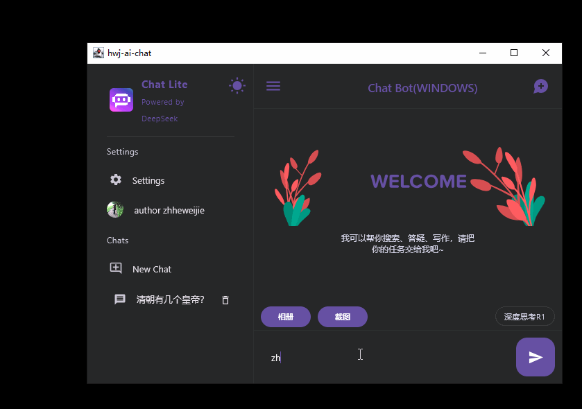
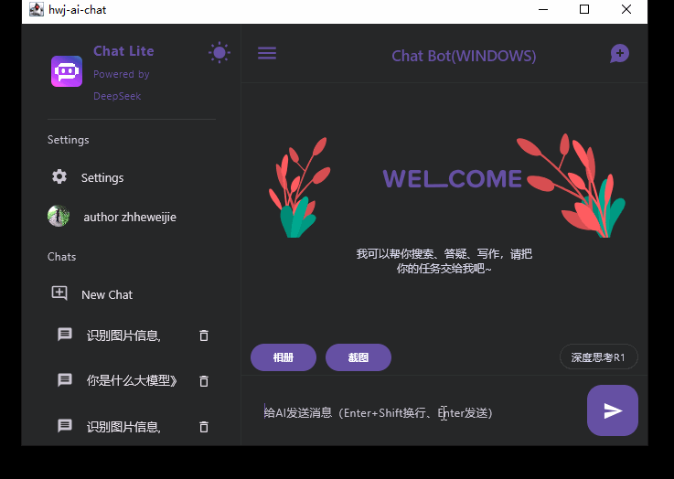
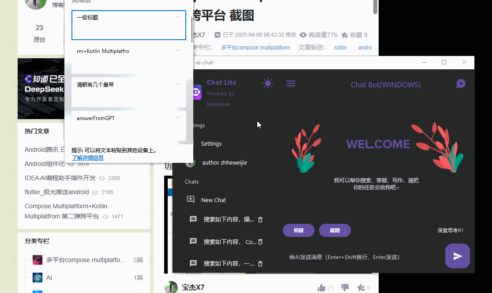

# testai1

#### 介绍

Compose Multiplatform + Kotlin Multiplatform.
A chat-prompt based app for Android, iOS, Desktop, Linux.

[English Version](./README.md)

#### 软件架构

以compose multiplatform为UI框架，kotlin
multiplatform为逻辑开发，实现Android、iOS、macOS、Windows、Linux端，以大模型api为接口调用数据，
kotlin 2.1.0，jdk 21（17也是支持的），
开发机器人聊天、文本问答、图片问答、截图、快捷键识别、翻译、历史保存、划词检测、深度思考、黑白主题切换。

#### 开发注意

编译环境注意

Android studio 2024-2025.1
macOs sonoma 14.3.1
Windows 11

kotlin 2.2.0,(旧的2.1.0也可以) gradle8.5.0

项目脚本环境
1.Gradle.properties  内设置当前的系统的环境gradle的本地路径，这样可以指定不同的jdk版本,windows电脑和mac电脑的肯定不同，不然就取gradle_home
2.jvmMain/resources/.env 是大模型的key,需要替换成自己的服务器和apikey，不然容易爆和过期

编译命令
Mac/windows 编译是在terminal实现，命令都写在 DesktopApp.kt类中

系统适配桥接
多平台定义的桥接接口除了Platform.kt类，在com.hwj.ai.except下的接口都是桥接，另外就是依赖注入di中的。

错误提示
项目是实验性验证多模态大模型的使用，包含接口数据结构的设计，界面UI的设计，引入了很多可能验证性依赖库。

注意：
1.当前没有使用的sqldelight,在开发web端的存储时一直报错最后放弃了，用了简单的saveKey方式存聊天历史。
2.objectbox数据库在纯android成功，但是kmp中无法用ksp生成代码，最后弃用。
3.验证ocr识别鼠标划词时引入bytedeco发现很难解决多行划词的不规则矩形，而且识别字错误多，最后弃用。
4.iosApp运行要在xcode启动，xcode中引入自定义的编译文件类，如果只是在ide编写了swift的代码文件还是不能直接参与xcode的编译，要在项目信息中手动引入，对Android开发者简直噩梦。

#### Mobile App (Android & iOS)

   

#### Desktop App

 

## 平台功能
我是使用硅基流动、deepseek、腾讯混元等大模型，文本问答用deepseek-v3，深度思考用deepseek-R1，图片问答用hunyuan-vision，助手工具问答Pro/Qwen/Qwen2.5-VL-7B-Instruct。

### 全平台
- [x] 1.多轮机器对话 ,支持多个大模型切换
- [x] 2.本地会话记录缓存，文本、图片会话加载
- [x] 3.黑暗模式切换，支持所有系统，支持代码框包裹
- [x] 4.富文本对代码支持，对部分公式函数支持
- [x] 5.系统图册选择后模型问答，支持每轮引用图片问答
- [x] 6.desktop端截图后的模型问答，手机拍照回答图片的问答
- [x] 7.多端编译，一套代码开发，适配不同机型和系统，磨平差异性
- [x] 8.大模型自动调度，接入深度思考R1
- [x] 9.消息对话内容可选择，可复制，可重新生成问答
- [x] 10.图片预览
- [x] 11.欢迎语动画welcome,支持lottie动画
- [x] 12.消息列表、历史列表根据内容自适应滚动条
- [x] 13.消息列表过长可一键置底
- [x] 14.抽屉布局自适应，桌面端可隐藏，手机端是抽屉
- [x] 15.点击头像跳转默认浏览器
- [x] 16.设置回答用中文或英文，实时生效
- [ ] 17.接入联网搜索，暂未有免费api，博查收费
- [ ] 18.本地知识库构建，离线小模型处理，多场景搜索算法智能调用，更多助手工具的使用。
### desktop端
- [x] 1.截图功能，[第五弹](https://blog.csdn.net/j7a2son/article/details/147047202?spm=1001.2014.3001.5502)文章单独放出实现代码，后面再融入更多需求后扩展了，截图可windows/mac，Mac使用时就会询问权限，windows添加了全局快捷键Alt+A响应快速截图然后拉起应用直接问答。Alt+B全局拉起应用主窗口。
- [x] 托盘隐藏最小化，托盘菜单有打开、退出，双击打开应用主窗口。
- [x] 这次实现了类似豆包的AI划词工具，但是支持的应用有限，选中的速度也没它快，因为是纯Java实现，用了JNA+UIAutomation组合技术架构，获取系统钩子监听鼠标状态，部分win32应用，如记事本和notepad++直接可用user32消息命令检测所选文字，主要支持Chrome浏览器、Edge浏览器，火狐不知道为啥只能定位到首个标签页。
- [x] 划词后，全局AI浮窗显示，可一键搜索、总结、复制，快速拉起主应用窗口进行问答。

[AI应用文章](https://blog.csdn.net/j7a2son/article/details/147615057?spm=1001.2014.3001.5502)